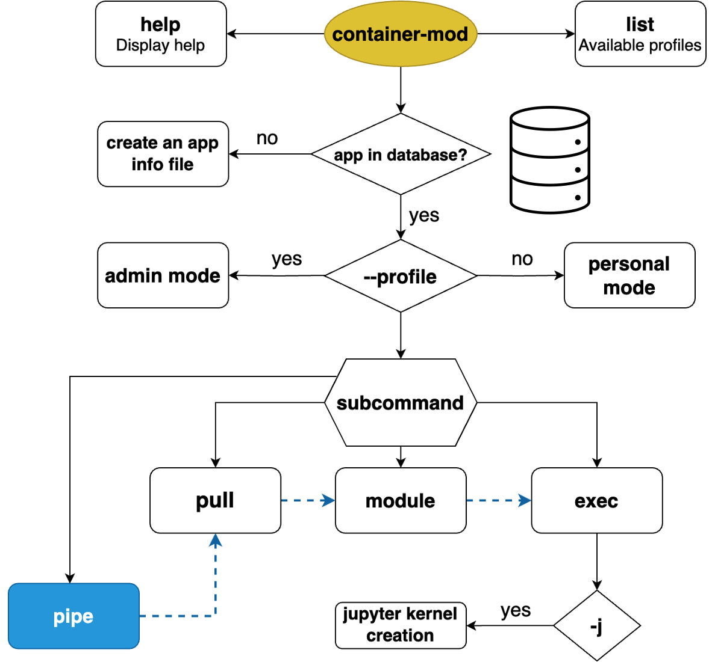

## container-mod

A versatile tool for HPC administrators and users to automatically convert container images into easy-to-use environment modules.

## Key Features

- **Automated Workflow**: Pulls container images, generates Lmod modulefiles, and creates executable wrappers in a single, streamlined process.
- **Seamless Execution**: Generates wrapper scripts for programs inside a container, allowing users to run them as if they were native applications.
- **Flexible Modes**: Supports both system-wide installation for all HPC users and a "personal mode" for individual user workflows.
- **Jupyter Integration**: Can automatically create Jupyter kernels from compatible containers for use in JupyterHub or Open OnDemand.
- **Extensible Database**: Uses a simple, text-based repository system to define application metadata and included executables.

---

## How It Works

`container-mod` relies on a simple database located in the `repos/` directory. Each application has a corresponding text file containing three required fields:

1.  **`Description`**: A summary of the application's purpose.
2.  **`Home Page`**: The URL for the application's official website or source code.
3.  **`Programs`**: A comma-separated list of the command-line executables provided by the application. The script uses this list to generate the wrapper scripts.

An optional `version` field can also be added to track the specific URIs of pulled containers for better reproducibility.

**Example `repos/bowtie2` file:**

```
Description: Bowtie 2 is an ultrafast and memory-efficient tool for aligning sequencing reads to long reference sequences.
Home Page: [https://github.com/BenLangmead/bowtie2](https://github.com/BenLangmead/bowtie2)
Programs: bowtie2,bowtie2-build,bowtie2-inspect

version("2.5.4", uri="docker://quay.io/biocontainers/bowtie2:2.5.4--h7071971_4")
version("2.5.1", uri="docker://quay.io/biocontainers/bowtie2:2.5.1--py310h8d7afc0_0")
```

---

## Prerequisites

- **Container Runtime**: Requires **Singularity** or **Apptainer** to be installed and available in your environment.
- **Module System**: The **Lmod** environment module system is required for modulefile generation and usage.

---

## Usage

### Subcommands

The script operates using one of four primary subcommands:

- `pull <URI>`: Downloads the container image.
- `module <URI>`: Generates the Lmod modulefile.
- `exec <URI>`: Creates the executable wrapper scripts.
- `pipe <URI>`: The recommended command. Executes `pull`, `module`, and `exec` sequentially.

### Options

| Option                | Description                                                                                                      |
| --------------------- | ---------------------------------------------------------------------------------------------------------------- |
| `-d, --dir DIR`       | Specifies a custom base output directory for all generated files.                                                |
| `-f, --force`         | Forces an overwrite of any existing files (images, modules, wrappers).                                           |
| `-m, --moduledir DIR` | Specifies a directory of existing modulefiles to use as templates.                                               |
| `-u, --update`        | Updates the application's file in the `repos` database with the new version information.                         |
| `-p, --personal`      | Runs in personal mode, creating all files in the user's home directory (`~/container-apps`, `~/privatemodules`). |
| `--profile <NAME>`    | Uses a specific configuration profile for setting default paths and variables.                                   |
| `-j, --jupyter`       | Generates a Jupyter kernel from the container, requires `ipykernel` to be installed inside.                      |
| `-h, --help`          | Displays the help message.                                                                                       |

---

## Examples & Workflows

### Standard Workflow (`pipe`)

The `pipe` command is the easiest way to process a container. This example pulls the `vcftools` image, creates a module, and generates the wrappers.

```bash
$ container-mod pipe docker://quay.io/biocontainers/vcftools:0.1.16--h9a82719_5
```

### Personal Mode Workflow

For individual use, the `-p` flag stores all files locally in your home directory.

```bash
# 1. Process the container in personal mode
$ container-mod pipe -p docker://staphb/bowtie2:2.5.4

# 2. Load your personal module environment and the new module
$ module load use.own
$ module load bowtie2/2.5.4

# 3. Run the containerized command as if it were native
$ bowtie2 --help
```

### Working with Local Image Files

If you already have a container image file (`.sif`), you can generate modules and wrappers for it directly, skipping the download. The script will prompt you for the application name and version.

```bash
$ container-mod pipe /path/to/my/image.sif
```

> **Note:** When using a local file, the original image is **not** moved or copied. The generated scripts will point to its original location.

### Creating a Jupyter Kernel

Use the `-j` flag to generate a Jupyter kernel, which will then be available to select in Jupyter Lab or Notebook.

```bash
$ container-mod pipe -p -j docker://tensorflow/tensorflow:2.18.0-jupyter
```

