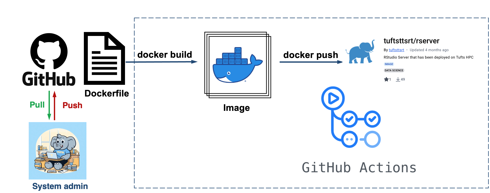

## Github action

GitHub Actions is a CI/CD (Continuous Integration / Continuous Deployment) service built into GitHub. It can be used to automate, customize, and execute software development workflows right in your GitHub repository.

Triggered by events such as:

- Push to a branch
- Pull request
- Tag creation (e.g., for releases)
- Scheduled times (cron jobs)

You define workflows in YAML files inside `.github/workflows/`.

### Why Use GitHub Actions for Containers?

With GitHub Actions, you can:

- Automatically build Docker images when you push code.
- Test your image.
- Push images to Docker Hub, GitHub Container Registry, or other registries.
- Do all of this without running Docker locally.

### Setting Secrets

You don’t put passwords in YAML.
Instead:

1. Go to your GitHub repo → Settings → Secrets and variables → Actions → New repository secret
2. Add:
   - `DOCKERHUB_USERNAME` = your Docker Hub username as `Variables`
   -  `DOCKERHUB_PASSWORD` = your Docker Hub access token (or password, but token is safer) as `Secretes`

